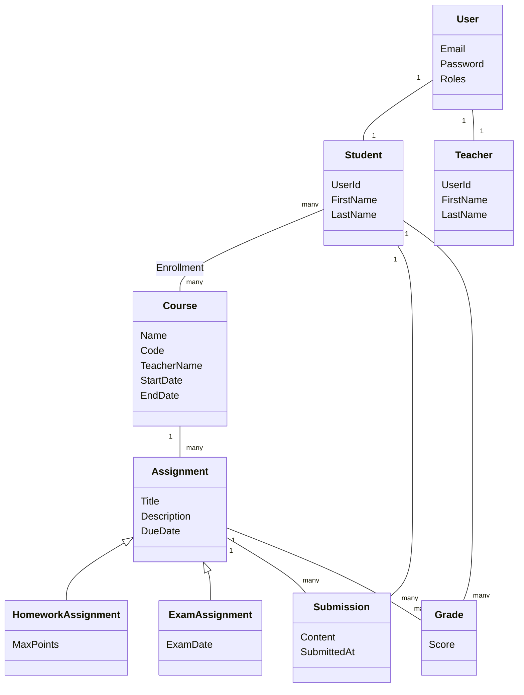

# MVP for study organization app

## Project Overview

This project is a WPF MVP application for organizing study activities.
It supports two user roles (Student and Teacher) and demonstrates:
- Domain-Driven Design (DDD)
- MVVM architecture
- EF Core with migrations and seed data
- Workflow/state logic
- Inheritance and aggregate roots

## Contributors

+ Anton Litvintsev
+ Iryna Tomberg
+ Margarita Orel

## Use Cases

Application in its current state is supposed to used by two user types - Student and Teacher. Unregistered user can create account specifying type of user (Student/Teacher), personal information and setting password. After that user can login into created account.

### Preseed user data

For testing purposes is possible to use user credentials that are preceed in database. They are:

+ `john.doe@ut.ee`, `123` for Student
+ `jane.doe@ut.ee`, `123` for Teacher

### Student

+ On the main page after login student can observe all courses. Courses can be filtered by different parameters (e.g. Name, Code, Status...). Note, that the 'Search' button must be pressed. Student can enroll themselves on course by pressing an according button.

+ If clicked on a course name, Student appears on the course page where can observe list of assignments for the course, assignment's properties, status and grade for the assignment. Student can submit their solution for assignment by clicking according button.

### Teacher

+ As a Student, on the main page after login Teacher can observe list of courses. All teachers can observe all courses.

+ If clicked on a course name, Teacher appears on the course page where can observe list of assignments for the course. Teacher can edit assignment by clicking on specific field in the table. Teacher can add assignment, specifying title, description, type of the assignment, due date and points that the assignment can give at maximum. Teacher can delete assignment by clicking red button with a cross.

+ Teacher can view all student submissions for the specific assignment and grade them.

+ In addition, teacher can export list of assignments for the course in the CSV format by pressing according button.

### All users

+ Both student and teacher can edit their account information or delete it.

## Architecture

### UI
  Defines UI and NVVM

  Input validation on UI level

  Contains resource file

  Dependency Injection setup for Navigation, ViewModels and Pages

### Application
  Defines operations that needs to be performed.

  Application services (IStudentService, ICourseService, etc.)

  DTOs, interfaces for repositories, CRUD operations for entities

### Domain
  Defines the core business logic and rules of the system.

  Here are defined entities.

  Domain does not rely on any other level

### Infrastructure
  Implements all technical details.

  EF Core DbContext, entity configurations and migrations

  Repository implementations (e.g., StudentRepository)

  Dependency Injection setup for Repositories and Services of the Application layer

### Interaction of layers

+ UI depends on DTOs and Interfaces defined on the Application layer.

+ Application layer depends on Entities and business rules defined on Domain layer.

+ Domain does not rely on any layer, doesn't contain technical implementation and only defines entities and business rules.

+ Infrastructure layer depends on Application Interfaces and Domain Entities.

### Entities

  - Course
  - User (stores basic information for authentication common for both Student and Teacher)
  - Student
  - Teacher
  - Enrollment
  - Assignment:
    + homework assignment (inherited)
    + exam assignment (inherited)
  - Grade
  - Submission
  - Group (currently is not connected to UI and is unused)

### Data Model Diagram

